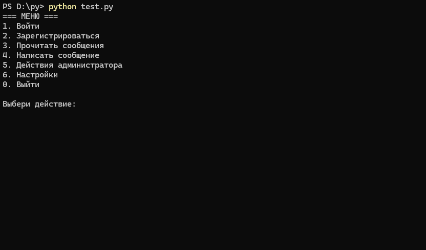

# Messenger Client



> [!IMPORTANT]
ЭТО БЕТА-ВЕРСИЯ НЕ ДОЛЖНА ИСПОЛЬЗОВАТЬСЯ ДО ВЫХОДА, ОЖИДАЙТЕ ПОЛНОЦЕННОГО РЕЛИЗА.
ВСЁ МОЖЕТ БЫТЬ ПЕРЕДЕЛАННО И/ИЛИ ИЗМЕНЕННО!
МОГУТ БЫТЬ ПРОБЛЕМЫ В РАБОТЕ API, МОГУТ ПРОИСХОДИТЬ ЗАВИСАНИИ ПРИЛОЖЕНИЯ ПОСЛЕ ОТПРАВКИ ЗАПРОСА.

## Описание

Этот проект представляет собой простой клиент командной строки для взаимодействия с API мессенджера. Клиент поддерживает основные функции, такие как авторизация, регистрация, отправка и получение сообщений, а также доступ к администраторским действиям (Работает лишь для администратора).

## Функционал

### Основные функции

- **Авторизация**: Вход в систему с использованием логина и пароля.
- **Регистрация**: Создание нового аккаунта.
- **Просмотр сообщений**: Чтение сообщений из чата.
- **Отправка сообщений**: Отправка новых сообщений в чат.
- **Администрирование**: Доступ к администраторским функциям.

### Настройки

- Возможность включать или выключать отображение ID сообщений.
- Автоматическое сохранение данных и токена доступа.

## Установка

1. Клонируйте репозиторий:

   ```bash
   git clone https://github.com/warmap1/messenger.git
   ```

2. Убедитесь, что у вас установлены все зависимости, необходимые для работы, такие как requests:

   ```bash
   pip install requests
   ```
**Не забудьте убедиться что у вас стоит последняя версия Python (3.12.5 на момент написания)**

3. Запустите приложение:

   ```bash
   python main.py
   ```

## Использование

### Запуск приложения

При запуске приложения будет отображаться главное меню с различными опциями. Выберите нужное действие, следуя инструкциям на экране.

```bash
=== МЕНЮ ===
1. Войти
2. Зарегистрироваться
3. Прочитать сообщения
4. Написать сообщение
5. Действия администратора
6. Настройки
0. Выйти
```

### Настройки

Вы можете изменить настройки приложения через меню настроек. Например, включить или выключить отображение ID сообщений.

```bash
=== НАСТРОЙКИ ===
1. Показ ID у сообщений - True/False - сейчас False
0. Выход в меню
```

## Структура проекта

- `main.py` - Основной файл, содержащий логику приложения.
- `get.py` - Файл, для получения данных из `data.json`.
- `errors.py` - Файл, для обработки ответов от сервера.
- `menu.py` - Файл, для хранения основного меню и меню настроек
- `data.json` - Файл, используемый для хранения настроек.
- `token.tok` - Файл для хранения токена доступа.

## Зависимости

- `requests` - Для выполнения HTTP-запросов к серверу.
- `json` - Для работы с JSON-данными.
- `os`, `sys`, `subprocess` - Для работы с файловой системой и выполнения системных команд.

## TODO
 - Разделить логистику приложения на несколько файлов.
 - Улучшить код.
 - Изменить интерфейс.

## Лицензия

Этот проект находиться под лицензией GNU General Public License v2.0.
